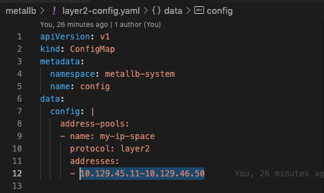
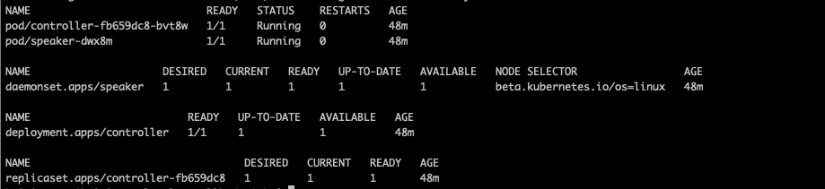
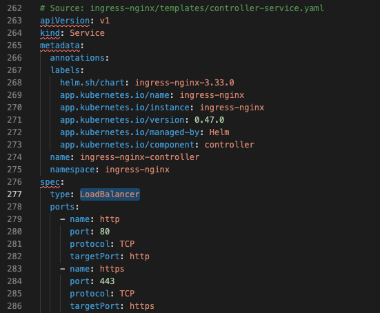
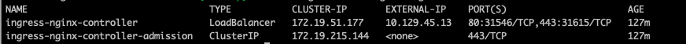
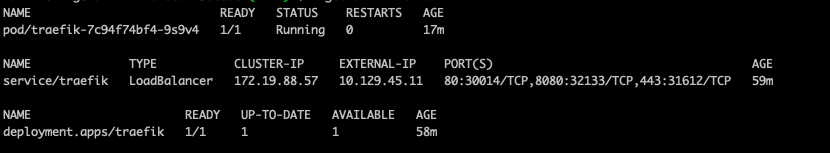
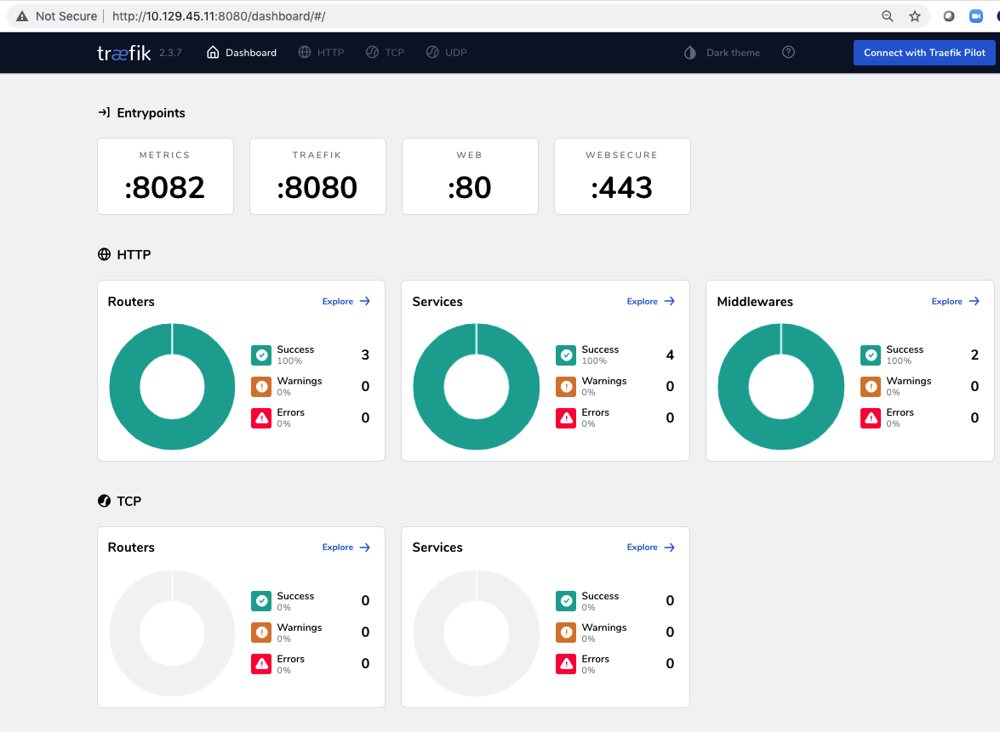

# metallb + ingress

オンプレミズKubernetsクラスタにmetallbロードバランサー、nginxイングレスコントローラをセットアップする。

[参考サイト](https://kubernetes.github.io/ingress-nginx/deploy/baremetal/)


## 手順

### 1. リソースファイルをダウンロード

```
git clonne https://github.com/ntnx-huimin/k8s-metallb-ingress.git
```

### 2. metallbのデプロイ

```
cd 1.metallb/
kubectl apply -f namespace.yaml
kubectl applhy -f metallb.yaml
kubectl create secret generic -n metallb-system memberlist --from-literal=secretkey="$(openssl rand -base64 128)"
```
### 3. IP Poolを設定

layer2-config.yamlにLB用IPアドレスのプールを設定する


```
kubectl applhy -f layer2-config.yaml
```


### 4. nginx ingress controllerのデプロイ

サービス「ingress-nginx-controller」の種類を「LoadBalancer」に変更



```
cd ../2.ingress-nginx
kubectl apply -f nginx-ingress/deploy.yaml
kubectl get all -n ingress-nginx
```


### 5. 確認用ワークロードをデプロイ

```
cd ../3.test/
kubectl apply -f test-nginx.yaml -f test-nginx.yaml
kubectl apply -f test-ingress-resource.yaml
```

### 6. Podにindex.htmlファイルを配置

```
kubectl get pod

# backoffice pod
kubectl exec -it httpd-799d75575c-8g8zd # 確認したpod名を利用
cd /usr/local/apache2/htdocs
mkdir -p backoffice
echo "backoffice with httpd">backoffice/index.html

# front pod
kubectl exec -it nginx-8c9df995d-p6lpm bash　# 確認したpod名を利用
cd /usr/share/nginx/html/
mkdir -p front
echo "Hello from front pod with nginx"> front/index.html

```

### 6. 確認

```
kubectl get svc -n ingress-nginx

curl http://10.129.45.13/front/index.html

curl http://10.129.45.13/backoffice/index.html
```

### 7. traefik  ingress controllerのデプロイ(Option)

```
cd ../4.traefik
kubectl create ns -n traefik
kubectl -n traefik apply -f 01-traefik-CRD.yaml
kubectl -n traefik apply -f 02-traefik-svc.yaml
kubectl -n traefik apply -f 03-traefik-Deployment.yaml

# 確認
kubectl get all -n traefik
```


ブラウザでURL: http://10.129.45.11:8080 にアクセス


