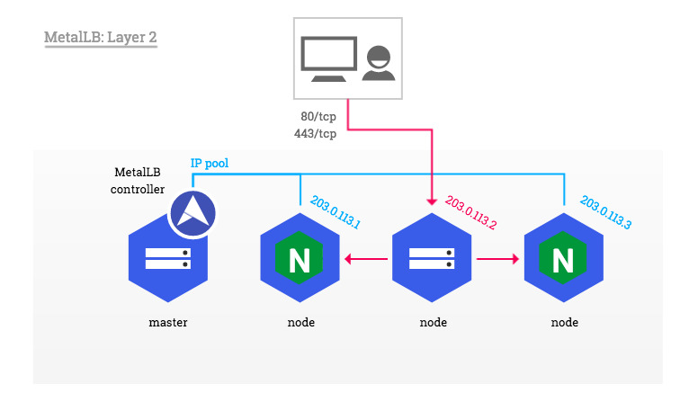

# metallb lab
オンプレミズKubernetsクラスタにmetallbロードバランサーをセットアップする。

[参考サイト](https://kubernetes.github.io/ingress-nginx/deploy/baremetal/)



# 手順

## 1. メタファイルをダウンロード

```
git clonne https://github.com/ntnx-huimin/metallb.git
```

## 2. IP Poolを設定

layer2-config.yamlにLB用IPアドレスのプールを設定する


## 3. デプロイ

```
kubectl apply -f namespace.yaml
kubectl apply -f metallb.yaml
kubectl layer2-config.yaml
kubectl apply -f nginx-ingress/deploy.yaml
```

## 4. 確認

```
kubectl get all -n metallb-system
```


```
kubectl get all -n ingress-nginx
```


## 5. 確認用ワークロードをデプロイ

```
kubectl apply -f test-nginx.yaml

# 確認
kubectl get all
```


